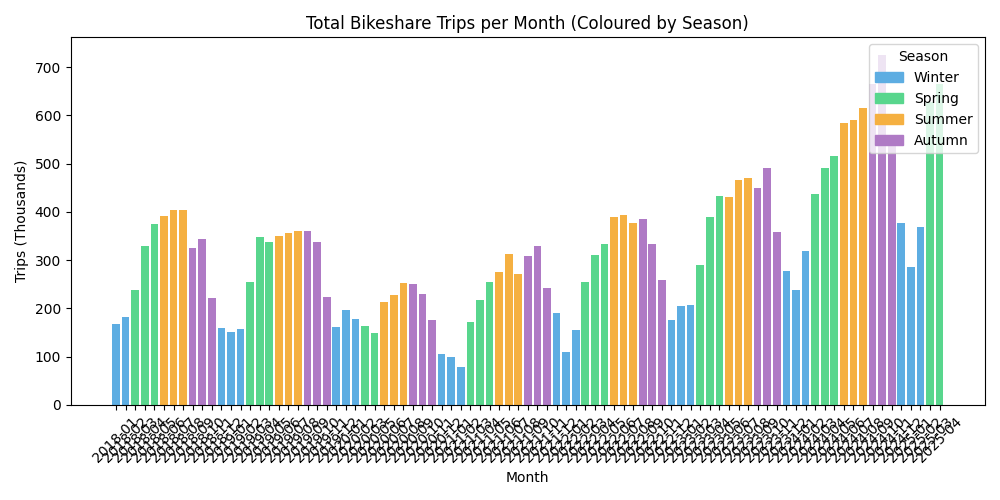
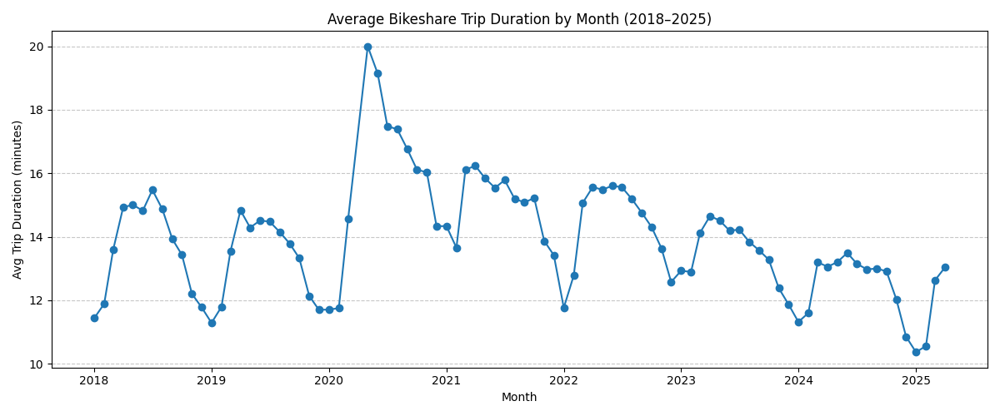
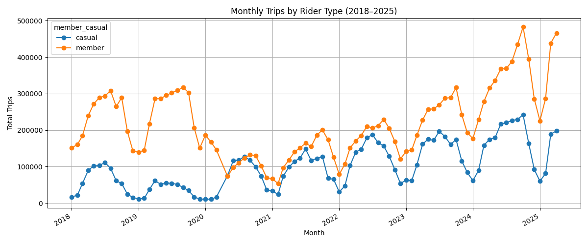

# Capital Bikeshare — Multi-Month Trip Data Analysis


End-to-end data engineering and analysis pipeline for **Washington D.C.'s Capital Bikeshare** system, ingesting ~900 MB of raw trip data (2018–2025) from monthly ZIP archives into a queryable SQLite database, with schema drift handling and visualised analytical insights.

---

## Project Overview

This project tackles the full data lifecycle: automated discovery and download of source files, robust ingestion that handles evolving CSV schemas across seven years of data, structured storage in SQLite, and exploratory analysis surfacing seasonality trends, COVID-era behavioural shifts, and long-term membership growth.

---

## Data Source & Scale

| Detail | Value |
|---|---|
| Source | [Capital Bikeshare System Data](https://ride.capitalbikeshare.com/system-data) (AWS S3 archive) |
| Coverage | January 2018 – 2025 |
| Raw data size | **~900 MB** across monthly ZIP files |
| Records | Millions of individual trip records |
| Storage | SQLite (`bikeshare_all.db`) |

Each ZIP file contains a CSV of trip records. The schema changed between older and newer exports — this project detects and harmonises those differences automatically.

---

## Pipeline Architecture

```
Capital Bikeshare S3 Archive
         │
         ▼
 automated_ingestion.py  ←── scrapes archive index, downloads new ZIPs
         │
         ▼
 load_zips_to_sqlite.py  ←── bulk-loads all ZIPs with schema drift handling
         │
         ▼
     SQLite DB  (bikeshare_all.db → trips table)
         │
         ▼
  add_indexes_to_db.py   ←── performance indexes on key columns
         │
         ▼
      analysis.py        ←── SQL queries + matplotlib visualisations
```

### Schema Drift Handling

Capital Bikeshare changed their CSV column naming convention over the years. The ingestion scripts detect which format each file uses and remap headers to a unified schema before writing to the database:

| Legacy column name | Unified column name |
|---|---|
| `Start date` | `started_at` |
| `End date` | `ended_at` |
| `Start station` | `start_station_name` |
| `Start station number` | `start_station_id` |
| `End station` | `end_station_name` |
| `End station number` | `end_station_id` |
| `Member type` | `member_casual` |

Legacy files that predate `ride_id` have a synthetic identifier generated automatically (`legacy_<index>`). Columns absent in older formats are filled with `NULL` rather than causing failures. Invalid or unparseable timestamps are dropped.

### SQLite Schema

```sql
CREATE TABLE trips (
    ride_id            TEXT,
    rideable_type      TEXT,
    started_at         TEXT,
    ended_at           TEXT,
    start_station_name TEXT,
    start_station_id   REAL,
    end_station_name   TEXT,
    end_station_id     REAL,
    start_lat          REAL,
    start_lng          REAL,
    end_lat            REAL,
    end_lng            REAL,
    member_casual      TEXT,
    year               INTEGER,
    month              INTEGER
);
```

Indexes are added on `started_at`, `ended_at`, `(year, month)`, and `member_casual` to make analytical queries fast across the full multi-year dataset.

---

## Analysis & Insights

SQL queries run directly against the SQLite database and results are plotted with Matplotlib.

### Ridership by Month (Coloured by Season)



Strong seasonal signal: summer peaks and winter troughs are consistent across all years. The COVID lockdowns of early 2020 are visible as a sharp drop followed by a partial recovery in summer 2020.

---

### Average Trip Duration by Month (2018–2025)



Trip durations spiked dramatically during the 2020–2021 lockdown period, consistent with commuters being replaced by leisure cyclists with longer, unhurried rides. Durations returned to pre-COVID levels by 2022 and have since trended slightly downward.

---

### Monthly Trips by Rider Type (2018–2025)



Annual membership (orange) has grown strongly and consistently. Casual ridership (blue) shows higher seasonal variance — peaking in summer — and has grown more slowly, suggesting the network is increasingly relied upon by regular commuters rather than tourists.

---


## Project Structure

```
capitalbikeshare_multimonth_analysis/
├── scripts/
│   ├── new_db.py                 # Create the SQLite database and trips table
│   ├── load_zips_to_sqlite.py    # Bulk-load all local ZIPs with schema harmonisation
│   ├── automated_ingestion.py    # Scrape archive, download new ZIPs, ingest incrementally
│   ├── add_indexes_to_db.py      # Add performance indexes to the database
│   └── analysis.py               # SQL queries and matplotlib chart generation
├── figures/                      # Output charts (PNG)
├── requirements.txt
└── README.md
```

---

## Setup & Usage

### 1. Install dependencies

```bash
pip install -r requirements.txt
```

### 2. Create the database

```bash
python scripts/new_db.py
```

### 3. Load data

**Option A — Download everything automatically:**

```bash
python scripts/automated_ingestion.py
```

This scrapes the Capital Bikeshare S3 archive, downloads any ZIP files not already present locally, and ingests them into the database. Re-running the script is safe: months already in the database are skipped.

**Option B — Bulk-load manually downloaded ZIPs:**

Place ZIP files (named `YYYYMM-capitalbikeshare-tripdata.zip`) in `input_data/monthly_zips/`, then run:

```bash
python scripts/load_zips_to_sqlite.py
```

### 4. Add indexes

```bash
python scripts/add_indexes_to_db.py
```

### 5. Run analysis

```bash
python scripts/analysis.py
```

Charts are saved to the `figures/` directory.

---

## Analysis Questions Explored

### Seasonality & Trends
- How does total ridership vary across months and seasons?
- Is trip duration longer in certain seasons?
- Did average durations spike during COVID (2020–2021)? **Yes** — lockdowns drove longer leisure rides. Durations normalised by 2022.

### Rider Type Behaviour
- How has the member vs. casual split evolved year-on-year?
- Does casual ridership show stronger seasonality than membership?

### Extensions & Related Work

Several of the analytical directions below have been explored as standalone projects:

- **Weekday vs. weekend usage patterns** → explored in [CareerFoundry CitiBike Portfolio](https://github.com/daniel-lee-wilkinson/careerfoundry_DA) for a single-month snapshot
- **Station-level net flow and geographic clustering** → explored in [DC Bikeshare GIS Analysis](https://github.com/daniel-lee-wilkinson/capitalbikeshare_station_analysis), applying spatial clustering and ZIP-level destination mapping to April 2025 data
- **Predictive modelling of station demand** → explored in [Capital Bikeshare Demand Forecast](https://github.com/daniel-lee-wilkinson/bikeshare_forecasting), applying ARIMA/ARIMAX time series models with weather covariates
- **Single-month deep pipeline analysis** → [Capital Bikeshare SQL Analysis](https://github.com/daniel-lee-wilkinson/capitalbikeshare_sql), modular ingestion pipeline with pytest suite and automated reporting

**Remaining potential extensions:**
- Extend weekday/weekend and geographic analyses across the full 2018–2025 period
- Real-time incremental ingestion as new monthly files are published to the S3 archive

## Data Licence

Trip data is published by [Capital Bikeshare](https://s3.amazonaws.com/capitalbikeshare-data/index.html) and licensed under the [Capital Bikeshare Data Lisence Agreement](https://capitalbikeshare.com/data-license-agreement)


